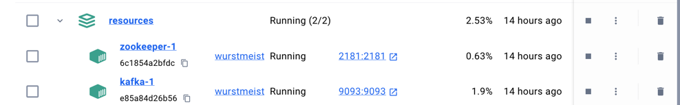

STEP 13.콘서트 트래픽 처리
캐싱 전략 : https://dev0hoon.tistory.com/369
토큰 전략 : https://dev0hoon.tistory.com/370

STEP 15.나의 시나리오에서 수행하는 쿼리들을 수집해보고, 필요하다고 판단되는 인덱스를 추가하고 쿼리의 성능개선 정도를 작성하여 제출
uri : https://dev0hoon.tistory.com/375

STEP 16.내가 개발한 기능의 트랜잭션 범위에 대해 이해하고, 서비스의 규모가 확장되어 MSA 형태로 서비스를 분리한다면 어떤 서비스로 분리 확장될지 설계하고, 그 분리에 따른 트랜잭션 처리의 한계와 해결방안에 대한 서비스 설계문서 작성 
uri : https://dev0hoon.tistory.com/378

STEP 17) - docker 를 이용해 kafka 를 설치 및 실행하고 애플리케이션과 연결

STEP 20) - 장애 대응 보고서
uri : https://dev0hoon.tistory.com/389